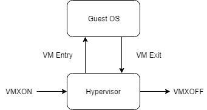

# Virtualization Interview Questions

## TENCENT Interview
### Virtualization
- Do you know the steps of the EPT initialization?

- What does the EPT GPA -> HPA translation process looks like in I/O virtualization?

- How to implement the PCI config space virtualization in VFIO?

- What does the VFIO interrupt do?

- How many threads/processes does QEMU have?

### OS basics
- In the interrupt context which locks could be used?

- What is the differences between the spinlock, spinlock_irq, spinlock_irq_save?

- kmalloc vs vmalloc?

- softirq vs workqueue?

- What happens when the process has context switch? Where is these context info saved in?

# Virtualization Concepts
## VMM

- an abstraction between the guest environment (guest OS) and the logical processor
- in charge of managing processor resources, system memory, interrupts, and I/O
- the technology that allows for multiple operating systems to share a single host platform and its hardware and resources

## Types of Hypervisor

type-1 hypervisor: Operates directly on hardware of the host, and can monitor operating systems that run above the VMM

type-2 hypervisor: Installed on an operating system, usually running at the lowest privilege level and supports operating systems above it

## Forms of Virtualization

Para-virtualization: It aims to present a machine-like software interface that exposes the fact that it is running in a virtualized environment.These interfaces work as hypercalls, normally perform privileged operations such as modifying page tables, model-specific registers, and so on. This virt tech is faster while it needs to modify the guest environment and exposes security issues

full-virtualization: It tries to trick the guest into believing it is running on physical hardware, the guest operating systems don’t know about the presence of a hypervisor. This form of virtualization allows the VMM full control over the behavior of the guest environment. For instance, if someone wanted to write to a control register it would cause a VM exit and trap into the hypervisor for validation and completion of the operation. This also allows the VMM to discard modifications it deems malicious or disruptive to VMM operation.

## Intel VT-x
### VMX operations

Two states: root and non-root, like transitions from user to kernel operations when a VMM is not present, the transitions while in VMX operation are called VMX transitions. To enter non-root operation (or guest operation) the VMM performs a VM entry, and to exit non-root operation and enter root operation (or the VMM) a VM exit is performed.  

